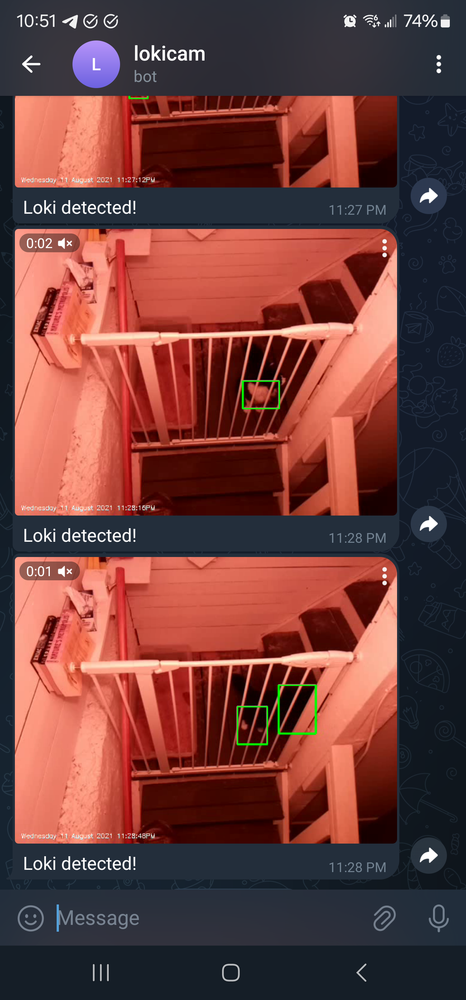

Lokicam
=======

Lokicam is a script that monitors a Raspberry Pi camera and when it detects motion, sends a video clip to a Telegram chat.

It needs two environment variables to operate:
* `TELEGRAM_BOT_TOKEN`: a Telegram API token. See [the Telegram website](https://core.telegram.org/bots/api) for how to get one.
* `TELEGRAM_CHAT_ID`: ID of a Telegram chat the bot should post to.

